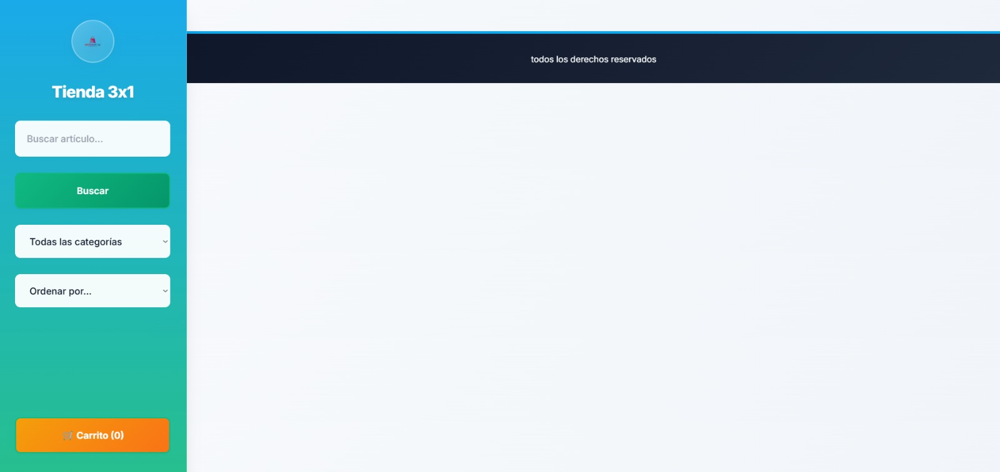

# Tienda 3x1

Una tienda en línea moderna y responsiva desarrollada con tecnologías web estándar que permite a los usuarios navegar, buscar, filtrar y comprar productos de forma intuitiva.

## Descripción

Tienda 3x1 es una aplicación web de comercio electrónico que consume la API de FakeStore para mostrar productos reales. La aplicación cuenta con un diseño moderno y responsivo, funcionalidades de carrito de compras, búsqueda en tiempo real, filtrado por categorías y ordenamiento de productos. Incluye persistencia local del carrito y una interfaz de usuario optimizada para dispositivos móviles y de escritorio.

## Características principales

- **Catálogo de productos dinámico**: Integración con FakeStore API para mostrar productos reales
- **Búsqueda en tiempo real**: Búsqueda instantánea mientras el usuario escribe
- **Filtrado por categorías**: Filtros dinámicos basados en las categorías disponibles
- **Ordenamiento múltiple**: Ordenar por precio (ascendente/descendente) y nombre (A-Z/Z-A)
- **Carrito de compras avanzado**: 
  - Agregar/eliminar productos
  - Modificar cantidades
  - Cálculo automático de totales
  - Persistencia en localStorage
- **Diseño responsivo**: Navegación lateral en escritorio que se adapta a móviles
- **Notificaciones en tiempo real**: Feedback visual para acciones del usuario
- **Manejo de errores**: Sistema robusto de manejo de errores con mensajes informativos
- **Modo oscuro automático**: Soporte para preferencias del sistema
- **Optimización de rendimiento**: Lazy loading de imágenes e implementación de debounce

## Tecnologías utilizadas

- **Frontend**: HTML5, CSS3, JavaScript (ES6+)
- **Estilos**: 
  - CSS Variables para theming
  - Tailwind CSS (CDN)
  - Google Fonts (Inter)
  - Gradientes y efectos visuales modernos
- **API**: FakeStore API (https://fakestoreapi.com)
- **Almacenamiento**: localStorage para persistencia del carrito
- **Arquitectura**: Vanilla JavaScript con arquitectura modular

## Requisitos previos

- Navegador web moderno (Chrome 60+, Firefox 55+, Safari 12+, Edge 79+)
- Conexión a internet para cargar productos desde la API
- JavaScript habilitado

## Instalación

1. **Clona o descarga el repositorio**:
   ```bash
   git clone [URL_DEL_REPOSITORIO]
   cd tienda-3x1
   ```

2. **Estructura de archivos requerida**:
   ```
   tienda-3x1/
   ├── index.html
   ├── css/
   │   ├── estilos.css
   │   └── media/
   │       ├── logo.png
   │       ├── tienda.png
   │       └── placeholder.png
   └── JS/
       └── main.js
   ```

3. **Agregar archivos de imagen**:
   - Coloca el logo de la tienda en `css/media/logo.png`
   - Coloca el favicon en `css/media/tienda.png`
   - Agrega una imagen placeholder en `css/media/placeholder.png`

4. **Servir la aplicación**:
   - **Opción 1**: Abrir `index.html` directamente en el navegador
   - **Opción 2**: Usar un servidor local:
     ```bash
     # Python 3
     python -m http.server 8000
     
     # Node.js (con live-server)
     npx live-server
     
     # PHP
     php -S localhost:8000
     ```

## Configuración

### Variables CSS personalizables

El archivo `estilos.css` incluye variables CSS que pueden modificarse para personalizar la apariencia:

```css
:root {
  --color-primary: #0ea5e9;        /* Color principal */
  --color-secondary: #10b981;      /* Color secundario */
  --color-accent: #f59e0b;         /* Color de acento */
  --color-danger: #ef4444;         /* Color de peligro */
  --nav-width: 280px;              /* Ancho de navegación */
  --transition-normal: 0.3s ease-in-out; /* Transiciones */
}
```

### Configuración de la API

La aplicación está configurada para usar FakeStore API. Para cambiar la API, modifica la URL en `main.js`:

```javascript
const response = await fetch('https://fakestoreapi.com/products');
```

## Uso

### Navegación básica

1. **Visualizar productos**: Los productos se cargan automáticamente al abrir la aplicación
2. **Buscar productos**: Usar la barra de búsqueda en la navegación lateral
3. **Filtrar por categoría**: Seleccionar una categoría del menú desplegable
4. **Ordenar productos**: Elegir un criterio de ordenamiento

### Carrito de compras

1. **Agregar productos**: Hacer clic en "Agregar al Carrito" en cualquier producto
2. **Ver carrito**: Hacer clic en el botón del carrito (🛒)
3. **Modificar cantidades**: Usar los botones + y - en el panel del carrito
4. **Eliminar productos**: Hacer clic en el botón de eliminar (🗑️)
5. **Realizar compra**: Hacer clic en "Realizar Compra" (simulación)

### Funcionalidades avanzadas

- **Búsqueda en tiempo real**: Escribe en el campo de búsqueda sin presionar enter
- **Búsqueda con Enter**: Presiona Enter para buscar
- **Cerrar carrito**: Hacer clic fuera del panel del carrito
- **Notificaciones**: Aparecen automáticamente para confirmar acciones

## Estructura del proyecto

```
tienda-3x1/
├── index.html                 # Página principal HTML
├── css/
│   ├── estilos.css           # Estilos principales con diseño responsivo
│   └── media/                # Recursos multimedia
│       ├── logo.png          # Logo de la tienda
│       ├── tienda.png        # Favicon
│       └── placeholder.png   # Imagen por defecto para productos
└── JS/
    └── main.js               # Lógica principal de la aplicación
```

### Componentes principales del código

#### HTML (index.html)
- Estructura semántica con header, main y footer
- Navegación lateral con controles de búsqueda y filtrado
- Contenedor dinámico para productos
- Panel lateral del carrito

#### CSS (estilos.css)
- Sistema de variables CSS para theming
- Diseño responsivo con navegación lateral
- Animaciones y transiciones fluidas
- Soporte para modo oscuro
- Grid system para productos

#### JavaScript (main.js)
- **Variables globales**: `productos`, `productosFiltrados`, `carrito`, `categorias`
- **Funciones principales**:
  - `fetchProducts()`: Obtiene productos de la API
  - `renderProducts()`: Renderiza productos en el DOM
  - `addToCart()`: Gestiona el carrito de compras
  - `searchProducts()`: Implementa búsqueda
  - `filterByCategory()`: Filtra por categorías
  - `applySorting()`: Ordena productos

## API

### Endpoint utilizado

La aplicación consume el siguiente endpoint de FakeStore API:

| Método | Endpoint | Descripción |
|--------|----------|-------------|
| GET | `https://fakestoreapi.com/products` | Obtiene todos los productos disponibles |

### Estructura de datos del producto

```javascript
{
  id: number,           // ID único del producto
  title: string,        // Nombre del producto
  price: number,        // Precio del producto
  category: string,     // Categoría del producto
  description: string,  // Descripción del producto
  image: string        // URL de la imagen del producto
}
```

## Testing

Actualmente el proyecto no incluye tests automatizados. Para probar manualmente:

### Lista de verificación de funcionalidades

- [ ] Carga inicial de productos
- [ ] Búsqueda por texto
- [ ] Filtrado por categorías
- [ ] Ordenamiento de productos
- [ ] Agregar productos al carrito
- [ ] Modificar cantidades en el carrito
- [ ] Eliminar productos del carrito
- [ ] Persistencia del carrito al recargar
- [ ] Proceso de compra simulado
- [ ] Responsive design en diferentes tamaños
- [ ] Manejo de errores de conexión

### Pruebas de rendimiento

- Verificar lazy loading de imágenes
- Comprobar debounce en búsqueda
- Validar smooth scrolling y animaciones

## Deployment

### Hospedaje estático

La aplicación puede desplegarse en cualquier servicio de hospedaje estático:

#### GitHub Pages
1. Subir archivos al repositorio de GitHub
2. Habilitar GitHub Pages en Settings
3. Seleccionar la rama main como fuente

#### Netlify
```bash
# Instalar Netlify CLI
npm install -g netlify-cli

# Desplegar
netlify deploy --prod --dir .
```

#### Vercel
```bash
# Instalar Vercel CLI
npm install -g vercel

# Desplegar
vercel --prod
```

### Consideraciones de deployment

- Asegurar que todas las rutas de archivos sean relativas
- Verificar conectividad con FakeStore API
- Comprobar HTTPS para evitar problemas de mixed content
- Validar que el favicon y recursos multimedia estén disponibles

## Contribución

### Guías para contribuir

1. **Fork del repositorio**
2. **Crear una rama de feature**:
   ```bash
   git checkout -b feature/nueva-funcionalidad
   ```
3. **Realizar cambios y commit**:
   ```bash
   git commit -m "Agregar nueva funcionalidad"
   ```
4. **Push y crear Pull Request**:
   ```bash
   git push origin feature/nueva-funcionalidad
   ```

### Estándares de código

- **JavaScript**: Usar ES6+ y async/await
- **CSS**: Seguir la metodología BEM para clases
- **HTML**: Estructura semántica y accesible
- **Comentarios**: Documentar funciones complejas
- **Manejo de errores**: Implementar try/catch apropiados

### Maquetacion




## Autor

Juan Camilo Rojas Arenas